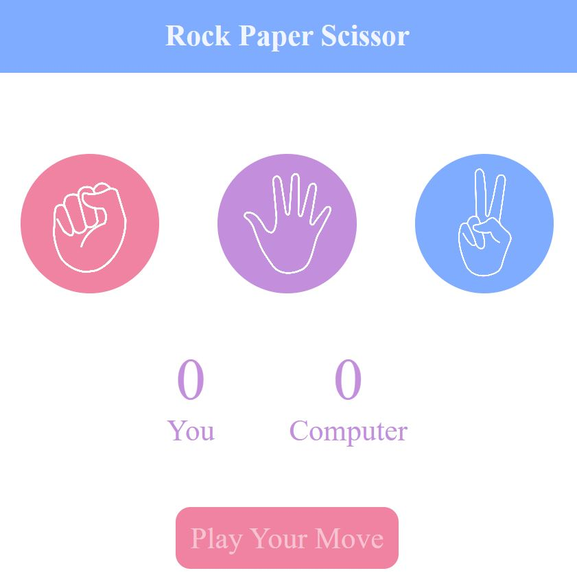

# Rock Paper Scissor Game

Welcome to the Rock Paper Scissor Game! This classic game is brought to the digital world, allowing you to play against the computer anytime. Choose your move wisely!

#### Web Design Preview

## Table of Contents

- [Introduction](#introduction)
- [Live Demo](#live-demo)
- [Features](#features)
- [Installation](#installation)
- [How to Play](#how-to-play)
- [Technology Stack](#technology-stack)
- [Project Structure](#project-structure)
- [Setup](#setup)

## Introduction

This Rock Paper Scissor Game is a simple, fun game built with HTML, CSS, and JavaScript. You can play it directly in your browser, with no need to install anything. Just open the game and start playing!

## Live Demo

You can try out the Weather App [here](https://mehwishjbe.github.io/rock-paper-sciossor-game/).

## Features

- Play Rock Paper Scissor against the computer
- Responsive design for both desktop and mobile devices
- Real-time score tracking

## Installation

No installation is required! Access the game directly through your web browser at: [Play Game](https://mehwishjbe.github.io/rock-paper-sciossor-game/)

## How to Play

1. Open the game link.
2. Click on your choice of Rock, Paper, or Scissors.
3. The game will display the outcome and update the scores accordingly.
4. Repeat and have fun!

## Technology Stack

- HTML5
- CSS3
- JavaScript

## Project Structure

The project's file structure is straightforward and consists of the following main files:

- `index.html`: The main HTML document of the app.
- `style.css`: Contains all the CSS styles for the app.
- `script.js`: Contains the JavaScript logic for playing game.

## Setup

To run this project locally:

1. Clone the repository to your local machine.
